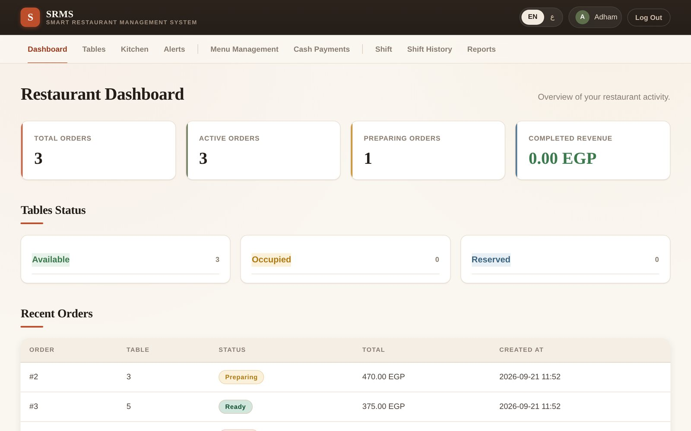
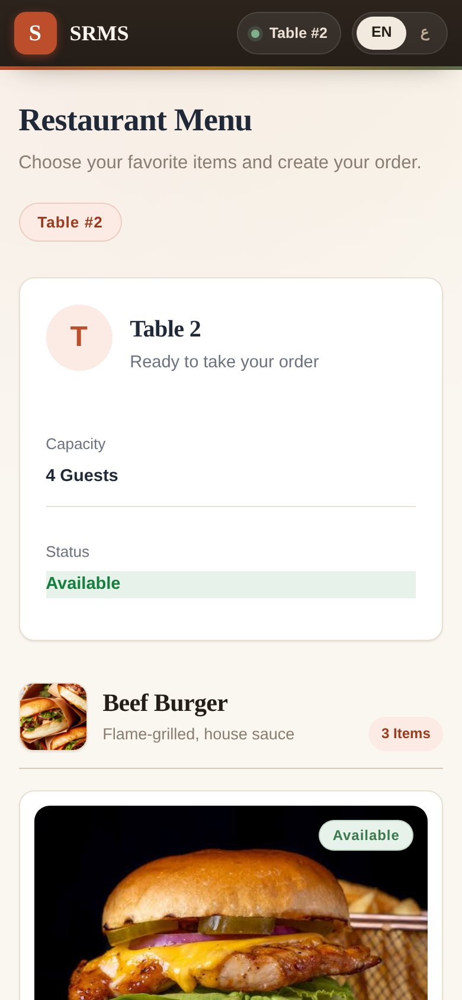
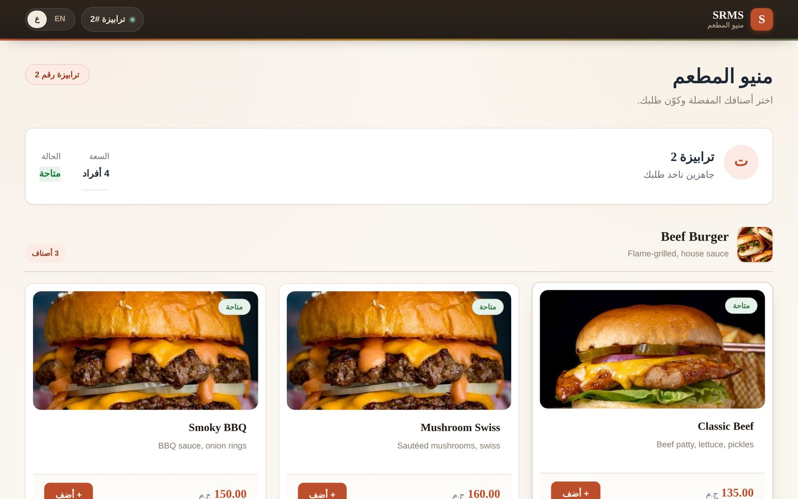
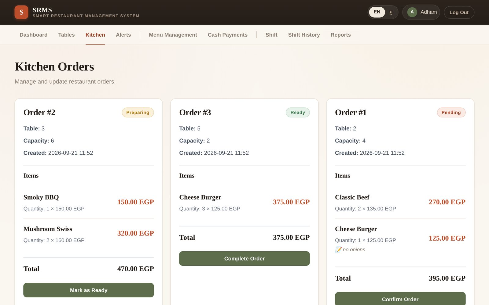
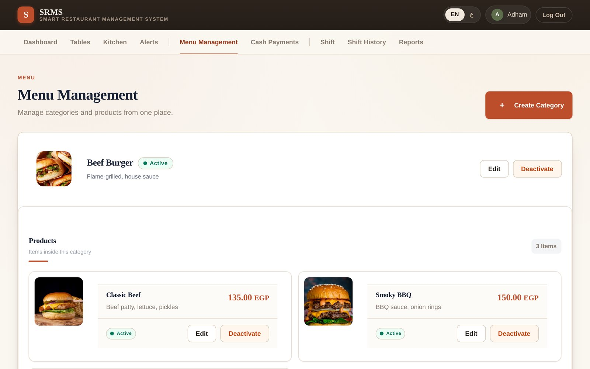
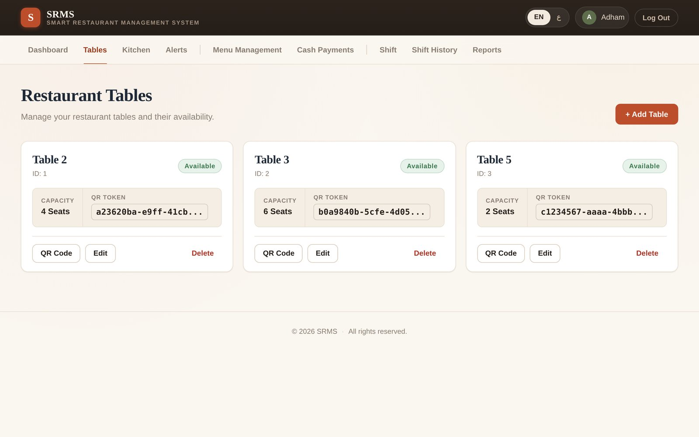
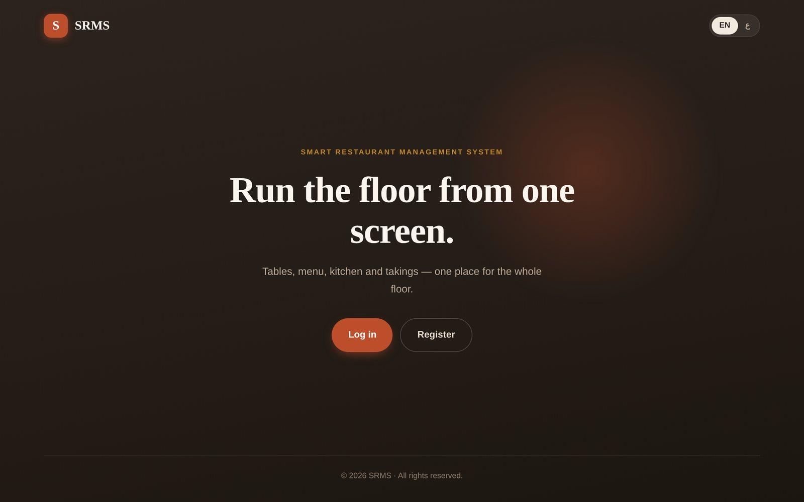
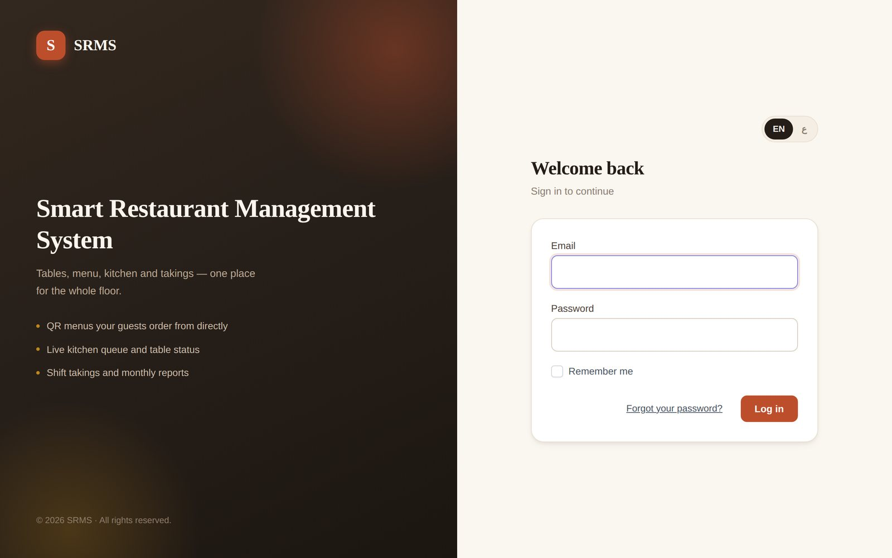
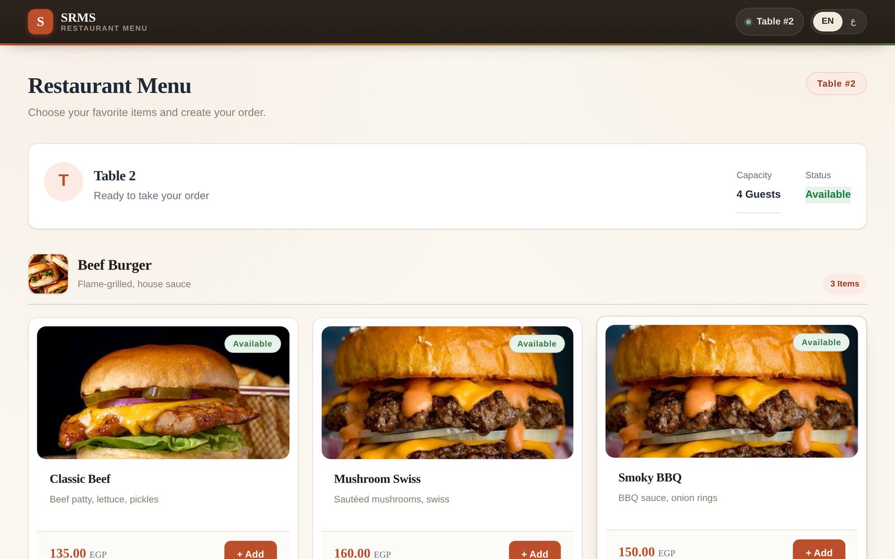
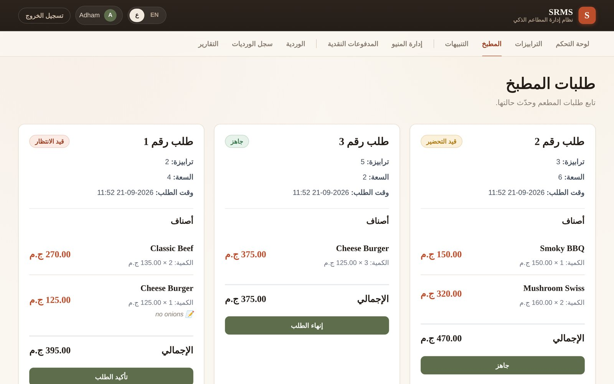

# SRMS — Smart Restaurant Management System

A Laravel web app that runs a restaurant floor end to end: guests scan a QR code on their table and order from their phone, the kitchen works through orders on a live board, and managers look after the menu, tables, cash, shifts and monthly reports. The whole interface works in **English and Arabic** (full right-to-left layout).



---

## Contents

- [Features](#features)
- [Screenshots](#screenshots)
- [Tech stack](#tech-stack)
- [Requirements](#requirements)
- [Installation](#installation)
- [Creating the first admin](#creating-the-first-admin)
- [How it works](#how-it-works)
- [Languages](#languages)
- [Project structure](#project-structure)
- [Troubleshooting](#troubleshooting)

---

## Features

### For guests (no account needed)

- **QR menu per table.** Every table has its own QR code that opens the menu already tied to that table.
- **Order from the phone.** Add items, change quantities, add a note per item ("no onions"), and leave a name and phone number if you want.
- **Pay by cash or card.** Card payment is a built-in simulation. See [Payments](#payments).
- **Edit after ordering.** Guests can change a submitted order for **2½ minutes**. After that, a **Request Waiter** button alerts the staff instead.

### For the kitchen

- **Live order board.** Every open order shows its table, items, notes and total.
- **One-tap status changes.** Move each order through `Pending → Confirmed → Preparing → Ready → Completed`.

### For managers (admin)

- **Dashboard.** Order counts, completed revenue, table status and the latest orders at a glance.
- **Tables.** Create tables, set capacity and status, and print each table's QR code.
- **Menu management.** Categories and products with photos, descriptions and prices. Switch any item on or off without deleting it.
- **Waiter alerts.** Guest requests appear under *Alerts*, and a badge in the navigation counts pending ones (it refreshes every 15 seconds).
- **Cash payments.** Confirm cash orders as paid and print an invoice.
- **Shifts.** Open a shift, then close it by entering the cash you counted. The system compares that with the cash it recorded and flags any **surplus** or **shortage**. Past shifts can be browsed and exported to Excel.
- **Reports.** A monthly report with revenue split by cash and card, average order value and the top 5 products, downloadable as PDF. Orders for any date range can also be exported to Excel.

---

## Screenshots

| Guest menu (phone) | Guest menu — Arabic |
|---|---|
|  |  |

**Kitchen board**



**Menu management**



**Tables**



<details>
<summary>More screenshots</summary>

**Landing page**



**Sign in**



**Guest menu (desktop)**



**Kitchen board — Arabic**



</details>

---

## Tech stack

| Layer | Used |
|---|---|
| Backend | Laravel 13, PHP 8.3+ |
| Database | MySQL / MariaDB |
| Auth | Laravel Breeze |
| Roles | spatie/laravel-permission (`admin`, `kitchen`) |
| QR codes | simplesoftwareio/simple-qrcode |
| PDF reports | barryvdh/laravel-dompdf |
| Excel exports | maatwebsite/excel |
| Front end | Blade, vanilla JavaScript, Vite, Tailwind (sign-in and profile pages only) |
| Styling | A custom design system in `public/css/srms-theme.css` |

---

## Requirements

- **PHP 8.3 or newer** with the `gd`, `zip`, `mbstring`, `intl`, `fileinfo`, `openssl` and `pdo_mysql` extensions
- **Composer**
- **Node.js 18+** and npm
- **MySQL 8 or MariaDB 10.4+** (XAMPP's MySQL works)

> **Use MySQL, not SQLite.** One migration changes the order-status column with MySQL-specific SQL, and SQLite also blocks the `confirmed` status, so orders can't move through the kitchen on SQLite.

---

## Installation

```bash
git clone https://github.com/Adham-El-Sayed/SRMS.git
cd SRMS

composer install
npm install
npm run build

cp .env.example .env          # Windows CMD: copy .env.example .env
php artisan key:generate
```

Create an empty database (for example `srms`), then set these lines in `.env`:

```ini
APP_NAME=SRMS
APP_URL=http://127.0.0.1:8000

DB_CONNECTION=mysql
DB_HOST=127.0.0.1
DB_PORT=3306
DB_DATABASE=srms
DB_USERNAME=root
DB_PASSWORD=
```

Then build the tables, link the image folder and start the server:

```bash
php artisan migrate
php artisan storage:link
php artisan serve
```

Open **http://127.0.0.1:8000**.

For development with hot reload, run `composer dev` instead of `php artisan serve`. It starts the server, queue worker, log viewer and Vite together.

---

## Creating the first admin

New accounts start **without a role**, so the management pages stay locked until you give one out. Register an account at `/register`, then run:

```bash
php artisan tinker
```

```php
use Spatie\Permission\Models\Role;

Role::findOrCreate('admin');
Role::findOrCreate('kitchen');

App\Models\User::where('email', 'you@example.com')->first()->assignRole('admin');
```

Use `assignRole('kitchen')` for kitchen staff. They can open the dashboard and the kitchen board, and the management pages stay locked.

---

## How it works

### The order journey

1. An admin creates a table. SRMS gives it a unique token and a QR code (**Tables → QR Code**, ready to print).
2. A guest scans it and lands on `/menu/{token}`, a menu that already knows which table they're at.
3. The guest submits the order. It appears on the **Kitchen** board as *Pending*.
4. The kitchen moves it to *Confirmed*, then *Preparing*, then *Ready*, and finally *Completed* once it's served.
5. Cash orders show up under **Cash Payments**, where staff confirm the money was received and can print an invoice.
6. Everything lands in the current **Shift** and in the **Reports**.

### Editing and waiter requests

After submitting, the guest sees a countdown and can change the order for 150 seconds. The limit is `OrderService::EDIT_WINDOW_SECONDS` in `app/Services/OrderService.php`. After it runs out, **Request Waiter** creates an alert that staff handle from the **Alerts** page.

### Payments

Card payment is **a simulation**. The card form checks the number, expiry and CVV, then waits briefly and treats the payment as successful. The camera "scan" fills in a test card. No money is charged. To go live, replace the marked block in `resources/views/menu/index.blade.php` (search for *"Replace this block with a real gateway call"*) with a real payment provider.

### Guest API

The QR menu talks to a small JSON API in `routes/api.php`:

| Method | Endpoint | Purpose |
|---|---|---|
| `POST` | `/api/orders` | Place an order |
| `GET` | `/api/orders` | List orders |
| `GET` | `/api/orders/{order}` | Read an order |
| `PUT` | `/api/orders/{order}/items` | Change items during the edit window |
| `PATCH` | `/api/orders/{order}/status` | Move an order to its next status |
| `POST` | `/api/orders/{order}/request-help` | Ask for a waiter |

> **Security note:** these endpoints have no authentication, so anyone who knows the URL can list orders or change an order's status. Before a real deployment, restrict the list and status routes to signed-in staff and tie the guest routes to the table's QR token.

---

## Languages

Every page, message and button is available in English and Arabic. The **EN / ع** switch in the top bar changes the language, and Arabic flips the whole layout to right-to-left. The choice is kept for the visitor's session.

- Arabic text lives in **`lang/ar.json`**, one entry per English phrase. Edit a line there to change a wording.
- New text in a Blade view should be wrapped as `{{ __('Your text') }}`. In page scripts, use `__t('Your text')`. Then add the Arabic line to `lang/ar.json`.
- Menu content (category and product names and descriptions) is stored in the database as typed, so it isn't translated automatically.
- The monthly **PDF** stays in English, because the PDF library can't lay out Arabic letters correctly.

---

## Project structure

```
app/
├── Enums/                   Table statuses
├── Http/Controllers/        One controller per area (tables, kitchen, shifts, reports…)
├── Http/Middleware/SetLocale.php   Applies the chosen language
├── Models/                  Order, OrderItem, Product, Category, RestaurantTable, Shift…
└── Services/                Business logic: OrderService (ordering rules, edit window), MenuService, ShiftService…
lang/ar.json                 Arabic translations
public/css/srms-theme.css    Colours, type, and every shared component style
resources/views/
├── layouts/                 app (staff), menu (guests), guest (sign-in)
├── menu/                    The QR ordering page
├── kitchen/  tables/  menu-management/  cash-payments/
├── shifts/   reports/  order-change-requests/  invoices/
routes/web.php               Pages, grouped by role
routes/api.php               The guest ordering API
```

The look is controlled from one place. Colours, fonts, corner radius and shadows are CSS variables at the top of `public/css/srms-theme.css`, so changing `--accent` recolours the whole app.

---

## Troubleshooting

**`Your Composer dependencies require a PHP version ">= 8.3.0"`**
Your terminal is using an older PHP (often XAMPP's 8.2). Check with `php -v`, and put a PHP 8.3+ folder ahead of XAMPP's in your system `PATH`.

**`requires ext-gd * -> it is missing from your system`**
Open the `php.ini` shown by `php --ini` and remove the `;` in front of `extension=gd` (also `zip` and `intl` if they're listed as missing).

**`SQLSTATE[HY000]: General error: 1 near "MODIFY": syntax error`**
The app is pointed at SQLite. Switch `.env` to MySQL as shown in [Installation](#installation).

**`Access denied for user 'root'@'localhost'`**
`DB_PASSWORD` in `.env` doesn't match your MySQL. XAMPP's default root password is empty, so leave the line as `DB_PASSWORD=`.

**Product photos don't show**
Run `php artisan storage:link`. If you copied the project from another machine, also copy its `storage/app/public` folder, because uploaded photos aren't stored in Git.

**A page still shows the old design after pulling changes**
Run `php artisan view:clear` and reload with Ctrl+F5.
